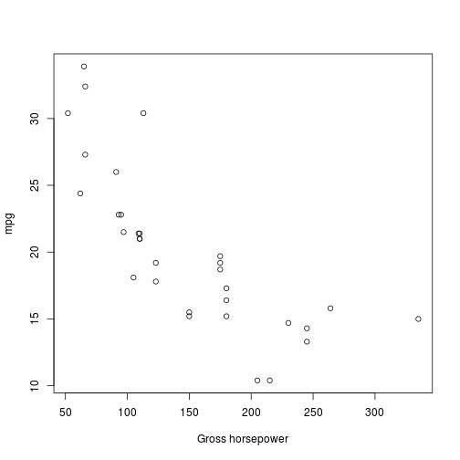

## MPG Predictor

* This is a shinyapp that predicts the miles per gallon for a car
* It uses whatever data you can provide to make the prediction
* The linear model will change based on which values you have available
* Allows you to use _up to 10_ parameters

--- 

## Basic Code

1. User inputs values for a prediction
2. Based on the selected parameters, a linear model is fitted to `mtcars` dataset
3. A prediction is made using the inputted values and the linear model

```r
  input <- data.frame( hp = 125, wt = 3 )
  fit <- lm(mpg ~ hp + wt, data = mtcars)
  predict <- predict(fit, input)  
  predict
```

```
##        1 
## 21.62216
```

--- &twocol

## Parameter Selection

*** =left

- Since there are many different opinions on which parameters effect the mpg the most, no parameters were excluded.
- Instead the user has the option to select the parameters they want.
- They can base their selection on the values that they have available or on the parameters that seem to correlate the most to `mpg`.
- An example of the correlation between `mpg` and `hp` (horsepower) is on the right.

*** =right

 

*** =full

---

## Dynamic UI

* To help facilitate the user experience a few measures were taken:
    1. The sidebar will change which parameters can be changed based on the settings
    2. There exist a setting tab that allow the user to select which parameters to use
    3. A help screen is the first tab a user sees
    4. The predicted mpg is given with the linear model and the inputted values

